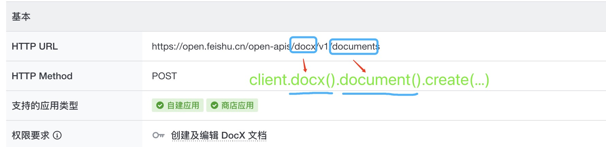
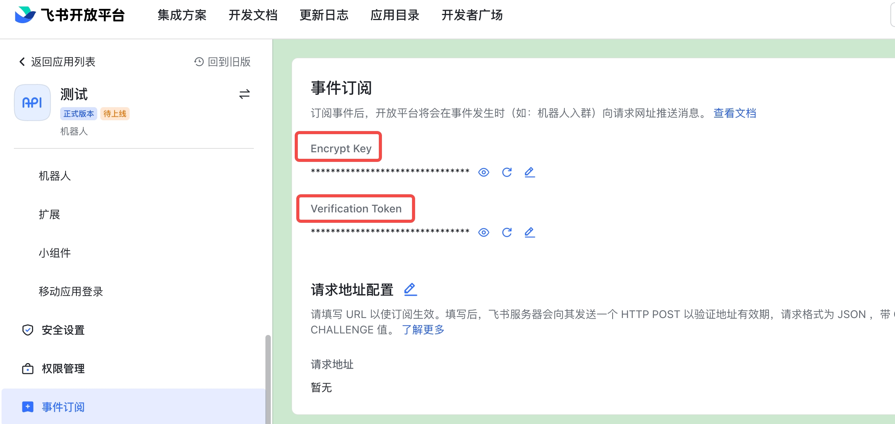
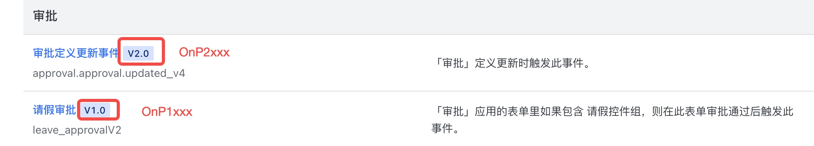

# 飞书开放接口SDK

旨在让开发者便捷的调用飞书开放API、处理订阅的消息事件、处理服务端推送的卡片行为。

## 目录

<!-- toc -->

- [安装](#安装)
- [API Client](#api-client)
    - [创建API Client](#创建api-client)
    - [配置API Client](#配置api-client)

- [API调用](#api调用)
    - [基本用法](#基本用法)
    - [设置请求选项](#设置请求选项)
    - [原生API调用方式](#原生api调用方式)

- [处理消息事件回调](#处理消息事件回调)
    - [概要](#概要)
    - [集成 servlet 容器](#集成-servlet-容器)
        - [安装集成包](#安装集成包)
        - [集成示例](#集成示例)
    - [消息处理器内给对应租户发消息](#消息处理器内给对应租户发消息)

- [处理卡片行为回调](#处理卡片行为回调)
    - [集成 servlet 容器](#集成-servlet-容器-1)
        - [安装集成包](#安装集成包-1)
        - [集成示例](#集成示例-1)
    - [返回卡片消息](#返回卡片消息)
    - [返回自定义消息](#返回自定义消息)
    - [卡片行为处理器内给对应租户发消息](#卡片行为处理器内给对应租户发消息)

- [加入答疑群](#加入答疑群)
- [License](#License)

<!-- tocstop -->

## 安装

- 运行环境：JDK 1.8及以上

- 最新版本 maven 坐标

```shell
<dependency>
  <groupId>com.larksuite.oapi</groupId>
  <artifactId>oapi-sdk</artifactId>
  <version>2.0.2-rc7</version>
</dependency>
```

## API Client

开发者在调用 API 前，需要先创建一个 API Client，然后才可以基于 API Client 发起 API 调用。

### 创建API Client

- 对于自建应用，可使用下面代码来创建一个 API Client

```java
  // 默认配置为自建应用 
  Client client=Client.newBuilder("appId","appSecret").build();
```

- 对于商店应用，需在创建 API Client 时，使用 marketplaceApp() 方法指定 AppType 为商店应用，商店应用开发指南可 [点击这里查看](https://bytedance.feishu.cn/docx/G4lndQqsgoenFhxcPlIc0Klinte)

```java 
Client client = Client.newBuilder("appId", "appSecret")
    .marketplaceApp() // 设置App为商店应用
    .build();
```

### 配置API Client

创建 API Client 时，可对 API Client 进行一定的配置，比如我们可以在创建 API Client 时设置日志级别、设置 http 请求超时时间等等：

```java
Client client=Client.newBuilder("appId","appSecret")
    .marketplaceApp() // 设置 app 类型为商店应用
    .openBaseUrl(BaseUrlEnum.FeiShu) // 设置域名，默认为飞书
    .helpDeskCredential("helpDeskId","helpDeskSecret") // 服务台应用才需要设置
    .requestTimeout(3,TimeUnit.SECONDS) // 设置httpclient 超时时间，默认永不超时
    .disableTokenCache() // 禁用token管理，禁用后需要开发者自己传递token
    .logReqAtDebug(true) // 在 debug 模式下会打印 http 请求和响应的 headers,body 等信息。
    .build();
```

每个配置选项的具体含义，如下表格：

<table>
  <thead align=left>
    <tr>
      <th>
        配置选项
      </th>
      <th>
        配置方式
      </th>
       <th>
        描述
      </th>
    </tr>
  </thead>
  <tbody align=left valign=top>
    <tr>
          <th>
            <code>appType</code>
          </th>
          <td>
            <code>client.marketplaceApp()</code>
          </td>
          <td>
    设置 App 类型为商店应用，ISV 开发者必须要设置该选项。
          </td>
    </tr>
<tr>
      <th>
        <code>logReqAtDebug</code>
      </th>
      <td>
        <code>client.logReqAtDebug(boolean logReqAtDebug)</code>
      </td>
      <td>
设置是否开启 Http 请求参数和响应参数的日志打印开关；
开启后，在 debug 模式下会打印 http 请求和响应的 headers,body 等信息。

在排查问题时，开启该选项，有利于问题的排查。

</td>
</tr>


<tr>
      <th>
        <code>BaseUrl</code>
      </th>
      <td>
        <code>client.openBaseUrl(BaseUrlEnum baseUrl)</code>
      </td>
      <td>
设置飞书域名，默认为FeishuBaseUrl，可用域名列表为：

```java 
public enum BaseUrlEnum {
  FeiShu("https://open.feishu.cn"),
  LarkSuite("https://open.larksuite.com"),
  ;
}
```

</td>
</tr>

<tr>
      <th>
        <code>tokenCache</code>
      </th>
      <td>
        <code>client.tokenCache(ICache cache)</code>
      </td>
      <td>
设置 token 缓存器，用来缓存 token 和 appTicket, 默认实现为内存。

如开发者想要定制 token 缓存器，需实现下面 Cache 接口:

```Java
public interface ICache {

  // 获取缓存值
  String get(String key);

  // 设置缓存值
  void set(String key, String value, int expire, TimeUnit timeUnit);
}
```

对于 ISV 开发者来说，如需要 SDK 来缓存 appTicket，需要实现该接口，实现提供分布式缓存。

</td>
</tr>


<tr>
      <th>
        <code>disableTokenCache</code>
      </th>
      <td>
        <code>client.disableTokenCache()</code>
      </td>
      <td>
设置是否开启 TenantAccessToken 的自动获取与缓存。

默认开启，如需要关闭可传递 false。
</td>
</tr>

<tr>
      <th>
        <code>helpDeskId、helpDeskToken</code>
      </th>
      <td>
        <code>client.helpDeskCredential(String helpDeskId, String helpDeskToken)</code>
      </td>
      <td>
该选项仅在调用服务台业务的 API 时需要配置。
</td>
</tr>


<tr>
      <th>
        <code>requestTimeout</code>
      </th>
      <td>
        <code>client.requestTimeout(long timeout, TimeUnit timeUnit)</code>
      </td>
      <td>
设置 SDK 内置的 Http Client 的请求超时时间，默认为0代表永不超时。
</td>
</tr>

<tr>
      <th>
        <code>httpTransport</code>
      </th>
      <td>
        <code>client.httpTransport(IHttpTransport httpTransport)</code>
      </td>
      <td>
设置传输层实现，用于替换 SDK 提供的默认实现。

开发者可通过实现下面的 IHttpTransport 接口来设置自定义的 传输实现:

```Java
public interface IHttpTransport {

  RawResponse execute(RawRequest request) throws Exception;
}
```

目前提供了两种实现：

1. 基于 [OKhttp](./larksuite-oapi/src/main/java/com/lark/oapi/core/httpclient/OkHttpTransport.java)
   的实现，使用 [demo](./sample/src/main/java/com/lark/oapi/sample/api/ClientSample.java)
2. 基于 [Apache HttpClient](https://github.com/larksuite/oapi-sdk-java-ext)
   的实现，使用 [demo](./sample/src/main/java/com/lark/oapi/sample/api/ClientSample.java)

</td>
</tr>

  </tbody>
</table>

## API调用

创建完毕 API Client，我们可以使用 ``Client.业务域.资源.方法名称`` 来定位具体的 API 方法，然后对具体的 API 发起调用。
商店应用开发指南可 [点击这里查看](https://bytedance.feishu.cn/docx/G4lndQqsgoenFhxcPlIc0Klinte)



飞书开放平台开放的所有 API
列表，可点击[这里查看](https://open.feishu.cn/document/ukTMukTMukTM/uYTM5UjL2ETO14iNxkTN/server-api-list)

### 基本用法

如下示例我们通过 client 调用文档业务的 Create 方法，创建一个文档：

```java 
import com.lark.oapi.Client;
import com.lark.oapi.core.utils.Jsons;
import com.lark.oapi.service.docx.v1.model.CreateDocumentReq;
import com.lark.oapi.service.docx.v1.model.CreateDocumentReqBody;
import com.lark.oapi.service.docx.v1.model.CreateDocumentResp;

public class DocxSample {
  
  public static void main(String arg[]) throws Exception {
    // 构建client
    Client client = Client.newBuilder("appId", "appSecret").build();

    // 发起请求
    CreateDocumentResp resp = client.docx().document()
        .create(CreateDocumentReq.newBuilder()
            .createDocumentReqBody(CreateDocumentReqBody.newBuilder()
                .title("title")
                .folderToken("fldcniHf40Vcv1DoEc8SXeuA0Zd")
                .build())
            .build()
        );

    // 处理服务端错误
    if (!resp.success()) {
      System.out.println(String.format("code:%s,msg:%s,reqId:%s"
          , resp.getCode(), resp.getMsg(), resp.getRequestId()));
      return;
    }

    // 业务数据处理
    System.out.println(Jsons.DEFAULT.toJson(resp.getData()));
  }
}
```

更多 API 调用示例：[ImSample.java](./sample/src/main/java/com/lark/oapi/sample/api/ImSample.java)

### 设置请求选项

开发者在每次发起 API 调用时，可以设置请求级别的一些参数，比如传递 userAccessToken ,自定义 headers 等：

```java 
import com.lark.oapi.Client;
import com.lark.oapi.core.request.RequestOptions;
import com.lark.oapi.core.utils.Jsons;
import com.lark.oapi.core.utils.Lists;
import com.lark.oapi.service.docx.v1.model.CreateDocumentReq;
import com.lark.oapi.service.docx.v1.model.CreateDocumentReqBody;
import com.lark.oapi.service.docx.v1.model.CreateDocumentResp;
import java.util.HashMap;
import java.util.List;
import java.util.Map;

public class DocxSample {

  public static void main(String arg[]) throws Exception {
    // 构建client
    Client client = Client.newBuilder("appId", "appSecret").build();

    // 创建自定义 Headers
    Map<String, List<String>> headers = new HashMap<>();
    headers.put("key1", Lists.newArrayList("value1"));
    headers.put("key2", Lists.newArrayList("value2"));

    // 发起请求
    CreateDocumentResp resp = client.docx().document()
        .create(CreateDocumentReq.newBuilder()
                .createDocumentReqBody(CreateDocumentReqBody.newBuilder()
                    .title("title")
                    .folderToken("fldcniHf40Vcv1DoEc8SXeuA0Zd")
                    .build())
                .build()
            , RequestOptions.newBuilder()
                .userAccessToken("u-2GxFH7ysh8E9lj9UJp8XAG0k0gh1h5KzM800khEw2G6e") // 传递用户token
                .headers(headers) // 传递自定义 Headers
                .build());

    // 处理服务端错误
    if (!resp.success()) {
      System.out.println(String.format("code:%s,msg:%s,reqId:%s"
          , resp.getCode(), resp.getMsg(), resp.getRequestId()));
      return;
    }

    // 业务数据处理
    System.out.println(Jsons.DEFAULT.toJson(resp.getData()));
  }
}
```

如上使用 RequestOptions 的 Builder 模式构建请求级别的参数。如下表格，展示了所有请求级别可设置的选项：

<table>
  <thead align=left>
    <tr>
      <th>
        配置选项
      </th>
      <th>
        配置方式
      </th>
       <th>
        描述
      </th>
    </tr>
  </thead>
  <tbody align=left valign=top>
    <tr>
      <th>
        <code>headers</code>
      </th>
      <td>
       <code> requestOptions.headers(Map&lt;String, List&lt;String>> headers)</code>
      </td>
      <td>
设置自定义请求头，开发者可在发起请求时，这些请求头会被透传到飞书开放平台服务端。

</td>
</tr>

<tr>
      <th>
        <code>userAccessToken</code>
      </th>
      <td>
        <code>requestOptions.userAccessToken(String userAccessToken)</code>
      </td>
      <td>
设置用户token，当开发者需要以用户身份发起调用时，需要设置该选项的值。

</td>
</tr>

<tr>
      <th>
        <code>tenantAccessToken</code>
      </th>
      <td>
        <code>requestOptions.tenantAccessToken(String tenantAccessToken)</code>
      </td>
      <td>
设置租户 token，当开发者自己维护租户 token 时（即创建Client时EnableTokenCache设置为了false），需通过该选项传递 租户 token。

</td>
</tr>

<tr>
      <th>
        <code>tenantKey</code>
      </th>
      <td>
        <code>requestOptions.tenantKey(tenantKey string)</code>
      </td>
      <td>
设置租户 key, 当开发者开发商店应用时，必须设置该选项。
</td>
</tr>


<tr>
      <th>
        <code>requestId</code>
      </th>
      <td>
        <code>requestOptions.requestId(requestId string)</code>
      </td>
      <td>
设置请求 ID，用来做请求的唯一标识，该 ID 会被透传到飞书开放平台服务端。

</td>
</tr>

  </tbody>
</table>

### 原生API调用方式

有些老版本的开放接口，不能生成结构化的 API， 导致 SDK 内无法提供结构化的使用方式，这时可使用原生模式进行调用：

```java 
package com.lark.oapi.sample.rawapi;

import com.lark.oapi.Client;
import com.lark.oapi.core.enums.AppType;
import com.lark.oapi.core.response.RawResponse;
import com.lark.oapi.core.token.AccessTokenType;
import com.lark.oapi.core.utils.Jsons;
import java.util.HashMap;
import java.util.Map;

/**
 * 原生http 调用方式
 */
public class RawApiCall {

  public static void main(String arg[]) throws Exception {
    // 构建client
    Client client = Client.newBuilder("appId", "appSecret").build();

    // 构建http body
    Map<String, Object> body = new HashMap<>();
    body.put("receive_id", "ou_c245b0a7dff2725cfa2fb104f8b48b9d");
    body.put("content", MessageText.newBuilder()
        .atUser("ou_155184d1e73cbfb8973e5a9e698e74f2", "Tom")
        .text("test content")
        .build());
    body.put("msg_type", MsgTypeEnum.MSG_TYPE_TEXT);

    // 发起请求
    RawResponse resp = client.post(
        "https://open.feishu.cn/open-apis/im/v1/messages?receive_id_type=open_id"
        , body
        , AccessTokenType.Tenant);

    // 处理结果
    System.out.println(resp.getStatusCode());
    System.out.println(Jsons.DEFAULT.toJson(resp.getHeaders()));
    System.out.println(new String(resp.getBody()));
    System.out.println(resp.getRequestID());
  }
}


```

更多 API 调用示例：[RawApiCall.java](./sample/src/main/java/com/lark/oapi/sample/rawapi/RawApiCall.java)

## 处理消息事件回调

关于消息订阅相关的知识，可以点击[这里查看](https://open.feishu.cn/document/ukTMukTMukTM/uUTNz4SN1MjL1UzM)

飞书开放平台开放的所有事件列表，可点击[这里查看](https://open.feishu.cn/document/ukTMukTMukTM/uYDNxYjL2QTM24iN0EjN/event-list)

### 概要

要处理消息事件，开发者需要启动一个 Web 服务，然后把 Web 服务的 URL 注册到飞书开放平台。飞书开放平台则把事件推送到开发者配置的 URL地址。

在 Java 中，比如常见的 Tomcat 容器、Jboss 容器是基于 Servlet 技术栈实现的； 为方便开发者集成这两种常用的 Web 技术栈实现的 Web 服务，飞书开放平台提供了集成方案。

### 集成 Servlet 容器

本节我们介绍，如何集成基于 Servlet 技术栈实现的 SpringBoot Web 框架。

#### 安装集成包

要想把 SDK 集成已有 SpringBoot
框架，开发者需要引入集成包 [oapi-sdk-java-ext](https://github.com/larksuite/oapi-sdk-java-ext)

需在项目 pom 文件中引入下面 maven 坐标

```shell
<dependency>
  <artifactId>oapi-sdk-servlet-ext</artifactId>
  <groupId>com.larksuite.oapi</groupId>
  <version>1.0.0-rc2</version>
  <exclusions>
    <exclusion>
      <artifactId>oapi-sdk</artifactId>
      <groupId>com.larksuite.oapi</groupId>
    </exclusion>
  </exclusions>
</dependency>
```

#### 集成示例

- 注入 ServletAdapter 实例到 IOC 容器

```Java
import com.lark.oapi.sdk.servlet.ext.ServletAdapter;
import org.springframework.boot.SpringApplication;
import org.springframework.boot.autoconfigure.SpringBootApplication;
import org.springframework.context.annotation.Bean;

@SpringBootApplication
public class AppStartup {

  public static void main(String[] args) {
    SpringApplication.run(AppStartup.class, args);
  }

  // 注入扩展实例到 IOC 容器
  @Bean
  public ServletAdapter getServletAdapter() {
    return new ServletAdapter();
  }
}
```

- 编写 Controller 注册事件处理器

```Java
import com.lark.oapi.core.utils.Jsons;
import com.lark.oapi.event.EventDispatcher;
import com.lark.oapi.service.contact.v3.ContactService;
import com.lark.oapi.service.contact.v3.model.P2UserCreatedV3;
import com.lark.oapi.service.im.v1.ImService;
import com.lark.oapi.service.im.v1.model.P1MessageReadV1;
import com.lark.oapi.service.im.v1.model.P2MessageReadV1;
import com.lark.oapi.service.im.v1.model.P2MessageReceiveV1;
import com.lark.oapi.sdk.servlet.ext.ServletAdapter;
import javax.servlet.http.HttpServletRequest;
import javax.servlet.http.HttpServletResponse;
import org.springframework.beans.factory.annotation.Autowired;
import org.springframework.web.bind.annotation.RequestMapping;
import org.springframework.web.bind.annotation.RestController;

@RestController
public class EventController {

  //1. 注册消息处理器
  private final EventDispatcher EVENT_DISPATCHER = EventDispatcher.newBuilder("verificationToken",
          "encryptKey")
      .onP2MessageReceiveV1(new ImService.P2MessageReceiveV1Handler() {
        @Override
        public void handle(P2MessageReceiveV1 event) {
          System.out.println(Jsons.DEFAULT.toJson(event));
          System.out.println(event.getRequestId());
        }
      }).onP2UserCreatedV3(new ContactService.P2UserCreatedV3Handler() {
        @Override
        public void handle(P2UserCreatedV3 event) {
          System.out.println(Jsons.DEFAULT.toJson(event));
          System.out.println(event.getRequestId());
        }
      })
      .onP2MessageReadV1(new ImService.P2MessageReadV1Handler() {
        @Override
        public void handle(P2MessageReadV1 event) {
          System.out.println(Jsons.DEFAULT.toJson(event));
          System.out.println(event.getRequestId());
        }
      }).onP1MessageReadV1(new ImService.P1MessageReadV1Handler() {
        @Override
        public void handle(P1MessageReadV1 event) {
          System.out.println(Jsons.DEFAULT.toJson(event));
          System.out.println(event.getRequestId());
        }
      })
      .build();

  //2. 注入 ServletAdapter 实例
  @Autowired
  private ServletAdapter servletAdapter;

  //3. 创建路由处理器
  @RequestMapping("/webhook/event")
  public void event(HttpServletRequest request, HttpServletResponse response)
      throws Throwable {
    //3.1 回调扩展包提供的事件回调处理器
    servletAdapter.handleEvent(request, response, EVENT_DISPATCHER);
  }
}

```

其中 EventDispatcher.newBuilder
方法的参数用于签名验证和消息解密使用，默认可以传递为空串；但是如果开发者的应用在 [控制台](https://open.feishu.cn/app?lang=zh-CN)
的【事件订阅】里面开启了加密，则必须传递控制台上提供的值。



需要注意的是注册处理器时，比如使用 onP2MessageReceiveV1
注册接受消息事件回调时，其中的P2为消息协议版本，当前飞书开放平台存在 [两种消息协议](https://open.feishu.cn/document/ukTMukTMukTM/uUTNz4SN1MjL1UzM#8f960a4b)
，分别为1.0和2.0。

如下图开发者在注册消息处理器时，需从 [事件列表](https://open.feishu.cn/document/ukTMukTMukTM/uYDNxYjL2QTM24iN0EjN/event-list)
中查看自己需要的是哪种协议的事件。 如果是1.0的消息协议，则注册处理器时，需要找以onP1xxxx开头的。如果是2.0的消息协议，则注册处理器时，需要找以OnP2xxxx开头的。



更多事件订阅示例：[event.java](./sample/src/main/java/com/lark/oapi/sample/event/EventController.java)

### 消息处理器内给对应租户发消息

针对 ISV 开发者，如果想在消息处理器内给对应租户的用户发送消息，则需先从消息事件内获取租户 key,然后使用下面方式调用消息 API 进行消息发送：

```java 
package com.lark.oapi.sample.event;

import com.lark.oapi.core.request.RequestOptions;
import com.lark.oapi.core.utils.Jsons;
import com.lark.oapi.event.EventDispatcher;
import com.lark.oapi.service.im.v1.ImService.P2MessageReceiveV1Handler;
import com.lark.oapi.service.im.v1.enums.ReceiveIdTypeEnum;
import com.lark.oapi.service.im.v1.model.CreateMessageReq;
import com.lark.oapi.service.im.v1.model.CreateMessageReqBody;
import com.lark.oapi.service.im.v1.model.P2MessageReceiveV1;
import com.lark.oapi.sdk.servlet.ext.ServletAdapter;
import javax.servlet.http.HttpServletRequest;
import javax.servlet.http.HttpServletResponse;
import org.springframework.beans.factory.annotation.Autowired;
import org.springframework.web.bind.annotation.RequestMapping;
import org.springframework.web.bind.annotation.RestController;

@RestController
public class EventController {
  //1. 注册消息处理器
  private final EventDispatcher EVENT_DISPATCHER = EventDispatcher.newBuilder("", "")
      .onP2MessageReceiveV1(new P2MessageReceiveV1Handler() {
        @Override
        public void handle(P2MessageReceiveV1 event) throws Exception {
          // 处理消息
          System.out.println(Jsons.DEFAULT.toJson(event));
          System.out.println(event.getRequestId());

          // 获取租户 key
          String tenantKey = event.getTenantKey();

          // 发送请求
          client.im().message().create(CreateMessageReq.newBuilder()
                  .receiveIdType(ReceiveIdTypeEnum.OPEN_ID)
                  .createMessageReqBody(CreateMessageReqBody.newBuilder()
                      .content("text")
                      .build())
                  .build()
              , RequestOptions.newBuilder()
                  .tenantKey(tenantKey)
                  .build());

        }
      }).build();

  //2. 注入 ServletAdapter 实例
  @Autowired
  private ServletAdapter servletAdapter;

  //3. 创建路由处理器
  @RequestMapping("/webhook/event")
  public void event(HttpServletRequest request, HttpServletResponse response)
      throws Throwable {
    //3.1 回调扩展包提供的事件回调处理器
    servletAdapter.handleEvent(request, response, EVENT_DISPATCHER);
  }
}


```

更多事件订阅示例：[event.java](./sample/src/main/java/com/lark/oapi/sample/event/EventController.java)

## 处理卡片行为回调

关于卡片行为相关的知识，可点击[这里查看](https://open.feishu.cn/document/ukTMukTMukTM/uczM3QjL3MzN04yNzcDN)

### 集成 Servlet 容器

本节我们介绍，如何集成基于 Servlet 技术栈实现的 SpringBoot Web框架。

#### 安装集成包

需在项目 pom 文件中引入下面 maven 坐标

```shell
<dependency>
  <artifactId>oapi-sdk-servlet-ext</artifactId>
  <groupId>com.larksuite.oapi</groupId>
  <version>1.0.0-rc2</version>
  <exclusions>
    <exclusion>
      <artifactId>oapi-sdk</artifactId>
      <groupId>com.larksuite.oapi</groupId>
    </exclusion>
  </exclusions>
</dependency>
```

#### 集成示例

- 注入 ServletAdapter 实例到 IOC 容器

```Java
import com.lark.oapi.sdk.servlet.ext.ServletAdapter;
import org.springframework.boot.SpringApplication;
import org.springframework.boot.autoconfigure.SpringBootApplication;
import org.springframework.context.annotation.Bean;

@SpringBootApplication
public class AppStartup {

  public static void main(String[] args) {
    SpringApplication.run(AppStartup.class, args);
  }

  // 注入扩展实例到 IOC 容器
  @Bean
  public ServletAdapter getServletAdapter() {
    return new ServletAdapter();
  }
}
```

- 编写 Controller 注册卡片行为处理器

```Java
import com.lark.oapi.card.CardActionHandler;
import com.lark.oapi.card.model.CardAction;
import com.lark.oapi.core.utils.Jsons;
import com.lark.oapi.sdk.servlet.ext.ServletAdapter;
import javax.servlet.http.HttpServletRequest;
import javax.servlet.http.HttpServletResponse;
import org.springframework.beans.factory.annotation.Autowired;
import org.springframework.web.bind.annotation.RequestMapping;
import org.springframework.web.bind.annotation.RestController;

@RestController
public class CardActionController {

  //1. 注册卡片处理器
  private final CardActionHandler CARD_ACTION_HANDLER = CardActionHandler.newBuilder("v", "e",
      new CardActionHandler.ICardHandler() {
        @Override
        public Object handle(CardAction cardAction) {
          System.out.println(Jsons.DEFAULT.toJson(cardAction));
          System.out.println(cardAction.getRequestId());
          return null;
        }
      }).build();

  // 2. 注入 ServletAdapter 示例
  @Autowired
  private ServletAdapter servletAdapter;

  //3. 注册服务路由
  @RequestMapping("/webhook/card")
  public void card(HttpServletRequest request, HttpServletResponse response)
      throws Throwable {
    //3.1 回调扩展包卡片行为处理回调
    servletAdapter.handleCardAction(request, response, CARD_ACTION_HANDLER);
  }
}
```

如上示例，如果不需要处理器内返回业务结果给飞书服务端，则直接在处理器内返回 null 。

更多卡片行为示例：[CardActionController.java](./sample/src/main/java/com/lark/oapi/sample/event/CardActionController.java)

### 返回卡片消息

如开发者需要卡片处理器内同步返回用于更新消息卡片的消息体，则可使用下面方法方式进行处理：

```java 
import com.lark.oapi.card.CardActionHandler;
import com.lark.oapi.card.model.CardAction;
import com.lark.oapi.card.model.MessageCard;
import com.lark.oapi.card.model.MessageCardElement;
import com.lark.oapi.core.utils.Jsons;
import com.lark.oapi.sdk.servlet.ext.ServletAdapter;
import javax.servlet.http.HttpServletRequest;
import javax.servlet.http.HttpServletResponse;
import org.springframework.beans.factory.annotation.Autowired;
import org.springframework.web.bind.annotation.RequestMapping;
import org.springframework.web.bind.annotation.RestController;

@RestController
public class CardActionController {

  //1. 注册卡片处理器
  private final CardActionHandler CARD_ACTION_HANDLER = CardActionHandler.newBuilder("v", "e",
      new CardActionHandler.ICardHandler() {
        @Override
        public Object handle(CardAction cardAction) {
          // 1.1 处理卡片行为
          System.out.println(Jsons.DEFAULT.toJson(cardAction));
          System.out.println(cardAction.getRequestId());

          // 1.2 构建响应卡片内容
          MessageCard card = MessageCard.newBuilder()
              .cardLink(cardURL)
              .config(config)
              .header(header)
              .elements(new MessageCardElement[]{div, note, image, cardAction, hr})
              .build();
          return card;
        }
      }).build();

  // 2. 注入 ServletAdapter 示例
  @Autowired
  private ServletAdapter servletAdapter;

  //3. 注册服务路由
  @RequestMapping("/webhook/card")
  public void card(HttpServletRequest request, HttpServletResponse response)
      throws Throwable {
    //3.1 回调扩展包卡片行为处理回调
    servletAdapter.handleCardAction(request, response, CARD_ACTION_HANDLER);
  }
}

```

更多卡片行为示例：[CardActionController.java](./sample/src/main/java/com/lark/oapi/sample/event/CardActionController.java)

### 返回自定义消息

如开发者需卡片处理器内返回自定义内容，则可以使用下面方式进行处理：

```go 
import com.lark.oapi.card.CardActionHandler;
import com.lark.oapi.card.model.CardAction;
import com.lark.oapi.card.model.CustomResponse;
import com.lark.oapi.core.utils.Jsons;
import com.lark.oapi.sdk.servlet.ext.ServletAdapter;
import java.util.Arrays;
import java.util.HashMap;
import java.util.List;
import java.util.Map;
import javax.servlet.http.HttpServletRequest;
import javax.servlet.http.HttpServletResponse;
import org.springframework.beans.factory.annotation.Autowired;
import org.springframework.web.bind.annotation.RequestMapping;
import org.springframework.web.bind.annotation.RestController;

@RestController
public class CardActionController {

  //1. 注册卡片处理器
  private final CardActionHandler CARD_ACTION_HANDLER = CardActionHandler.newBuilder("v", "e",
      new CardActionHandler.ICardHandler() {
        @Override
        public Object handle(CardAction cardAction) {
          // 1.1 处理卡片行为
          System.out.println(Jsons.DEFAULT.toJson(cardAction));
          System.out.println(cardAction.getRequestId());

          //1.2 返回自定义结果
          Map<String, Object> map = new HashMap<>();
          map.put("key1", "value1");
          map.put("ke2", "value2");
          CustomResponse customResponse = new CustomResponse();
          customResponse.setStatusCode(0);
          customResponse.setBody(map);
          Map<String, List<String>> headers = new HashMap<String, List<String>>();
          headers.put("key1", Arrays.asList("a", "b"));
          headers.put("key2", Arrays.asList("c", "d"));
          customResponse.setHeaders(headers);
          return customResponse;
        }
      }).build();

  // 2. 注入 ServletAdapter 示例
  @Autowired
  private ServletAdapter servletAdapter;

  //3. 注册服务路由
  @RequestMapping("/webhook/card")
  public void card(HttpServletRequest request, HttpServletResponse response)
      throws Throwable {
    //3.1 回调扩展包卡片行为处理回调
    servletAdapter.handleCardAction(request, response, CARD_ACTION_HANDLER);
  }
}
```

更多卡片行为示例：[CardActionController.java](./sample/src/main/java/com/lark/oapi/sample/event/CardActionController.java)

### 卡片行为处理器内给对应租户发消息

针对 ISV 开发者，如果想在卡片行为处理器内给对应租户的用户发送消息，则需先从卡片行为内获取租户 key ,然后使用下面方式调用消息 API 进行消息发送：

```java
import com.lark.oapi.card.CardActionHandler;
import com.lark.oapi.card.model.CardAction;
import com.lark.oapi.card.model.CustomResponse;
import com.lark.oapi.core.utils.Jsons;
import com.lark.oapi.sdk.servlet.ext.ServletAdapter;
import java.util.Arrays;
import java.util.HashMap;
import java.util.List;
import java.util.Map;
import javax.servlet.http.HttpServletRequest;
import javax.servlet.http.HttpServletResponse;
import org.springframework.beans.factory.annotation.Autowired;
import org.springframework.web.bind.annotation.RequestMapping;
import org.springframework.web.bind.annotation.RestController;

@RestController
public class CardActionController {

  //1. 注册卡片处理器
  private final CardActionHandler CARD_ACTION_HANDLER = CardActionHandler.newBuilder("v", "e",
      new CardActionHandler.ICardHandler() {
        @Override
        public Object handle(CardAction cardAction) {
          // 1.1 处理卡片行为
          System.out.println(Jsons.DEFAULT.toJson(cardAction));
          System.out.println(cardAction.getRequestId());

          // 1.2 获取租户 key
          String tenantKey = cardAction.getTenantKey();
          // 发送请求
          client.im().message().create(CreateMessageReq.newBuilder()
                  .receiveIdType(ReceiveIdTypeEnum.OPEN_ID)
                  .createMessageReqBody(CreateMessageReqBody.newBuilder()
                      .content("text")
                      .build())
                  .build()
              , RequestOptions.newBuilder()
                  .tenantKey(tenantKey)
                  .build());

          return null;
        }
      }).build();

  // 2. 注入 ServletAdapter 示例
  @Autowired
  private ServletAdapter servletAdapter;

  //3. 注册服务路由
  @RequestMapping("/webhook/card")
  public void card(HttpServletRequest request, HttpServletResponse response)
      throws Throwable {
    //3.1 回调扩展包卡片行为处理回调
    servletAdapter.handleCardAction(request, response, CARD_ACTION_HANDLER);
  }
}

```

更多卡片行为示例：[CardActionController.java](./sample/src/main/java/com/lark/oapi/sample/event/CardActionController.java)

## 加入答疑群
[单击加入答疑群](https://applink.feishu.cn/client/chat/chatter/add_by_link?link_token=858k8fd2-dc34-4cbf-bfc9-cbe0c1cb01dd)
## License

使用 MIT


